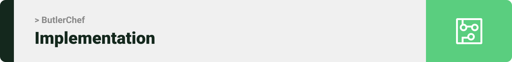
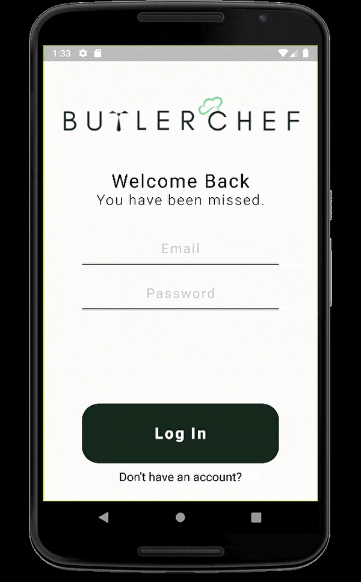
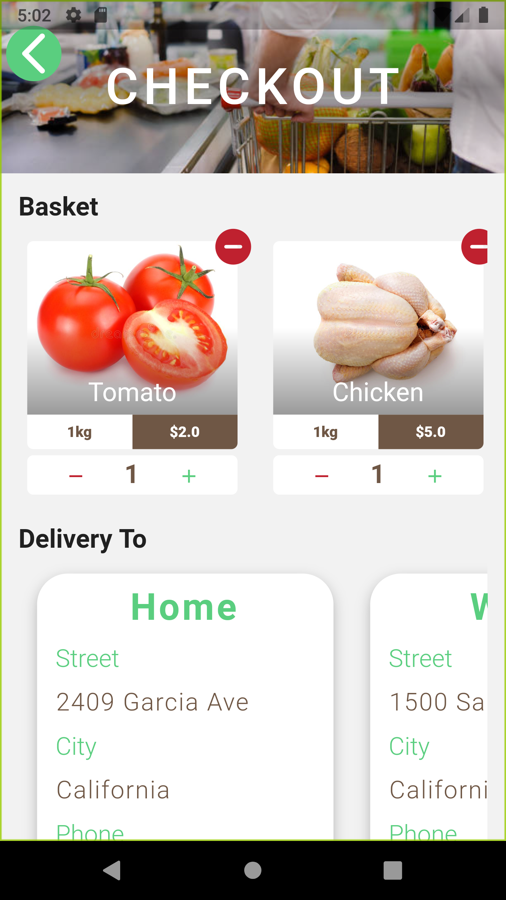

<div align="center">

> Hello world! This is the project’s summary that describes the project plain and simple, limited to the space available. 


**[PROJECT PHILOSOPHY](https://github.com/MariamElZaatari/ButlerChef#-project-philosophy) • [WIREFRAMES](https://github.com/MariamElZaatari/ButlerChef#-wireframes) • [TECH STACK](https://github.com/MariamElZaatari/ButlerChef#-tech-stack) • [IMPLEMENTATION](https://github.com/MariamElZaatari/ButlerChef#-impplementation) • [HOW TO RUN?](https://github.com/MariamElZaatari/ButlerChef#-how-to-run)**

</div>

<br><br>


> ButlerChef allows people on-the-go to maintain their eating habits in a fast-paced and easy-manner, through the shop, fridge, and simply by browsing recipes.
> 
> ButlerChef provides the user with his own fridge to store items and track feasible recipes. 
> The user can browse recipes and mark them as favorite and as cooked for later reference. 
> Finally, the user can purchase missing ingredients from the ButlerChef shop.

### User Stories
- As a user, I want to browse a recipe, to see further details.
- As a user, I want to browse my favorites, my cooked, and my own recipes for faster access to my needs.
- As a user, I want to browsse ablums, so that I can find quick links.
- As a user, I want to post recipes publicly, to share them with friends.
- As a user, I want to edit my profile, to enhance the looks of it and attract followers.
- As a user, I want to mark recipes as favorite, to find them faster.
- As a user, I want to mark recipes as cooked, to keep track of my cooked meals.
- As a user, I want to see the rate of a recipe, to find good recipes faster.
- As a user, I want to search for recipes by name, to find recipes faster.
- As a user, I want to store my fridge items, to browse related recipes or order missing ingredients of a recipe.
- As a user, I want to order missing ingredients from the recipe, to not waste time searching elsewhere.
- As a user, I want to get my address using Google Maps, for a faster shopping process.
- As a user, I want to add either my current location or any other location for delivery, for a more convenient and personalized experience.


<br><br>


> This design was planned before on paper, then moved to Figma app for the fine details.
Note that i didn't use any styling library or theme, all from scratch and using pure css modules

| Login  | Home/Search  | Shop | Checkout |
| ----| ----| ----| ----|
| <p align="center">  </p>| <p align="center">  </p>| <p align="center">  </p>| <p align="center">  </p>


<br><br>


Here's a brief high-level overview of the tech stack the Well app uses:

- This project uses the [Flutter app development framework](https://flutter.dev/). Flutter is a cross-platform hybrid app development platform which allows us to use a single codebase for apps on mobile, desktop, and the web.
- For persistent storage (database), the app uses the [MySQL](https://www.mysql.com/) package which allows the app to have a structured collection of data.It is a relational database management system that is based on structured query language (SQL).
- The backend is implemented using Java along with Springboot Framework, which is an open-source micro framework that has become a major player in the backend enterprise Java ecosystem.
- The app uses the font ["Roboto"](https://fonts.google.com/specimen/Work+Sans) as its main font, and the design of the app adheres to the material design guidelines.


<br><br>


> Using the above mentioned tech stacks and the wireframes build with figma from the user sotries we have, the implementation of the app is shown as below, these are screenshots from the real app

<!-- Login -->
<table border="1" width="100%">
<tr>
  <th colspan=2> <b>Login</b></th>
</tr>
<tr>
  <td width="50%"><p align="center">  </p></td>
  <td width="50%"><p align="center">  </p></td>
</tr>
</table>

<!-- Home/Search -->
<table border="1" width="100%">
<tr>
  <th colspan=2> <b>Home/Search</b></th>
</tr>
<tr>
  <td width="50%"><p align="center">  </p></td>
  <td width="50%"><p align="center">  </p></td>
</tr>
</table>

<!-- Browse Recipe -->
<table border="1" width="100%">
<tr>
  <th colspan=2> <b>Browse Recipe</b></th>
</tr>
<tr>
  <td width="50%"><p align="center">  </p></td>
  <td width="50%"><p align="center">  </p></td>
</tr>
</table>

<!-- Shop -->
<table border="1" width="100%">
<tr>
  <th colspan=2> <b>Shop</b></th>
</tr>
<tr>
  <td width="50%"><p align="center">  </p></td>
  <td width="50%"><p align="center">  </p></td>
</tr>
</table>

<!-- Google Maps -->
<table border="1" width="100%">
<tr>
  <th colspan=2> <b>Google Maps</b></th>
</tr>
<tr>
  <td width="50%"><p align="center">  </p></td>
  <td width="50%"><p align="center">  </p></td>
</tr>
</table>

<!-- Checkout -->
<table border="1" width="100%">
<tr>
  <th colspan=2> <b>Checkout</b></th>
</tr>
<tr>
  <td width="50%"><p align="center">  </p></td>
  <td width="50%"><p align="center">  </p></td>
</tr>
</table>

<!-- Post Recipe -->
<table border="1" width="100%">
<tr>
  <th colspan=2> <b>Post Recipe</b></th>
</tr>
<tr>
  <td width="50%"><p align="center">  </p></td>
  <td width="50%"><p align="center">  </p></td>
</tr>
</table>

<!-- Post Recipe Ingredients -->
<table border="1" width="100%">
<tr>
  <th colspan=2> <b>Post Recipe Ingredients</b></th>
</tr>
<tr>
  <td width="50%"><p align="center">  </p></td>
  <td width="50%"><p align="center">  </p></td>
</tr>
</table>

<!-- Post Recipe Directions -->
<table border="1" width="100%">
<tr>
  <th colspan=2> <b>Post Recipe Directions</b></th>
</tr>
<tr>
  <td width="50%"><p align="center">  </p></td>
  <td width="50%"><p align="center">  </p></td>
</tr>
</table>

<!-- Fridge -->
<table border="1" width="100%">
<tr>
  <th colspan=2> <b>Fridge</b></th>
</tr>
<tr>
  <td width="50%"><p align="center">  </p></td>
  <td width="50%"><p align="center">  </p></td>
</tr>
</table>

<!-- Profile -->
<table border="1" width="100%">
<tr>
  <th colspan=2> <b>Profile</b></th>
</tr>
<tr>
  <td width="50%"><p align="center">  </p></td>
  <td width="50%"><p align="center">  </p></td>
</tr>
</table>


<br><br>


To get a local copy up and running follow these simple steps.

### Prerequisites
* xampp
  ```sh
  https://www.apachefriends.org/download_success.html
  ```
* IntelliJ IDEA
  ```sh
  https://www.jetbrains.com/idea/download/#section=windows
  ```
* java 1.8
  ```sh
  https://java.com/en/download/help/windows_manual_download.html
  ```
* Android Studio
  ```sh
  https://developer.android.com/studio
  ```
* Flutter
  ```sh
  docs.flutter.dev/get-started/install/windows
  ```


### Installation

1. Clone the repo
   ```sh
   git clone https://github.com/MariamElZaatari/ButlerChef.git
   ```
2. Flutter Get Dependencies
   ```sh
   flutter pub get
   ```
